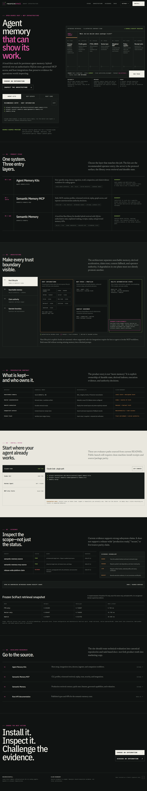
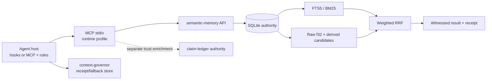

# recursiveintell-web

The source-scoped **Witness Plane** website deployed at `recursiveintell.com`.

The site reorganizes RecursiveIntell around one product family:

1. **`semantic-memory`** — the Rust retrieval and durable-state core
2. **`semantic-memory-mcp`** — the MCP protocol and policy surface
3. **`agent-memory-kits`** — host integrations, doctors, ingestion, and companion workflows



## Artifacts

| Path | Purpose |
|---|---|
| `index.html` | Full responsive **Witness Plane** prototype |
| `concepts.html` | Three council directions: Systems Monograph, Witness Plane, Chain of Custody |
| `DESIGN.md` | Machine-readable and human-readable design-system contract |
| `BRIEF.md` | Claim-bounded product and content brief |
| `COUNCIL.md` | Synthesized decision from the product, technical, and visual council |
| `docs/witness-plane-desktop.png` | Verified desktop viewport receipt |
| `docs/witness-plane-mobile.png` | Verified 390×844 mobile viewport receipt |

## Preview

```bash
cd /home/sikmindz/Coding/recursiveintell-web
python3 -m http.server 8765 --bind 127.0.0.1
```

Open:

- `http://127.0.0.1:8765/`
- `http://127.0.0.1:8765/concepts.html`

The prototype is standalone HTML/CSS/JavaScript. It has no build step or runtime dependency.

## Verification and deployment

```bash
python3 scripts/verify_static.py
```

GitHub Actions runs the same fail-fast verifier on pull requests and pushes to `main`. Vercel serves the repository root as a no-build static project; `vercel.json` explicitly clears the former Next.js framework, build, and install settings and applies production security headers.

## Council verdict

The old portfolio framing is memorable but hides the strongest current product family. The replacement should be a **Decide / Learn** surface for engineers:

- choose the correct layer
- inspect the retrieval and trust architecture
- understand what remains local and authoritative
- inspect evidence scope and limitations
- copy a current integration path

The council selected **The Witness Plane**: dark, precise, diagram-first, with magenta reserved for receipts/witness state and lime reserved for authority/verified state.

## Architecture shown by the prototype



Key boundaries:

- SQLite is authoritative; indexes and candidate artifacts are derived.
- Complete replay inputs are opt-in.
- Claim trust is a separate verified authority.
- Recall authority does not imply assertion or action authority.
- Receipts record execution evidence; they do not prove truth, correctness, security, or task success.

## Interaction coverage

The full prototype includes:

- keyboard-operable Core / MCP / Kits selector
- copyable install commands
- user-triggered witnessed-search trace
- interactive architecture focus states
- host-specific integration tabs
- expandable anonymized receipt shape
- responsive ownership/status tables
- mobile navigation and persistent Install / Docs actions
- reduced-motion behavior

## Evidence boundary

This is a **source-scoped technical preview**, not a public release-readiness claim.

The content is grounded in current local source and the 2026-07-12 hostile audit. The audited flagship source gates passed, while release-wide status remained blocked by advisory, package/path, dirty-source, and live/source coherence issues.

Public launch should wait for:

- clean immutable source revisions
- source/package/registry parity
- advisory resolution or explicit accepted-risk scope
- clean-machine install receipts
- generated technical facts and current `tools/list` evidence
- source/package/live artifact hashes

See `BRIEF.md` and `COUNCIL.md` for exact claim rules.

## Visual system

The design system is specified in `DESIGN.md` and implemented as CSS custom properties at the top of `index.html`.

Primary tokens:

| Role | Value |
|---|---|
| Ground | `#101312` |
| Panel | `#171B19` |
| Text | `#F1F0E8` |
| Muted | `#A4AAA3` |
| Rule | `#38413B` |
| Witness / receipt | `#E657A7` |
| Authority / verified | `#B7E36A` |
| Qualified / warning | `#F0A45D` |

No atmospheric gradients, glassmorphism, fake metrics, testimonials, or generic feature-card grid.

## Verification performed

- HTML parsed successfully for `index.html` and `concepts.html`
- inline JavaScript parsed successfully with Node
- both pages returned HTTP 200 from a local server
- full-page desktop visual review at a 1440×900 viewport
- full-page mobile visual review at a 390×844 viewport
- product selector, architecture focus, install tabs, copy controls, mobile menu, and witnessed trace exercised in browser
- keyboard arrow navigation and single-tab-stop behavior verified for both tab sets
- no document-level horizontal overflow at 1440px or 390px
- clean browser console and zero captured page errors
- axe-core 4.12.1: zero automated violations on both pages
- all public GitHub/docs links returned HTTP 200

The previous Next.js portfolio is preserved on the remote branch `archive/pre-witness-plane-2026-07-13` and in the verified local Git bundle `/home/sikmindz/Coding/archives/recursiveintell-web-pre-witness-plane-2026-07-13.bundle`.
